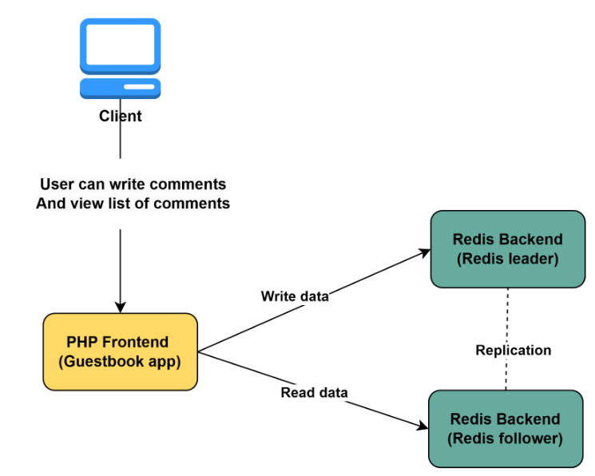
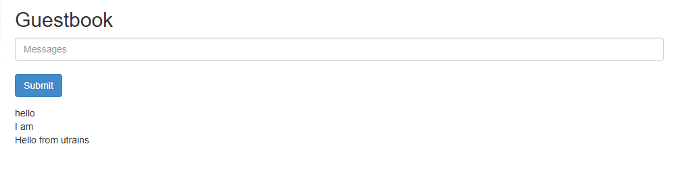

**Note: This Lab should be done in the EKS cluster**

## Lab: Deploying PHP Guestbook application with Redis

### Description
A Guestbook App is a simple web application where users can submit and view messages, similar to leaving comments in a guestbook.

#### How It Works
- Users visit the web page
- They enter a message (like "Hello from John!")
- The message is saved in a database (in this case, Redis)
- Other users can see all messages

#### Why use Redis?
Redis (Remote Dictionary Server) is an open-source, **in-memory** data store making it a great choice for storing guestbook messages. Here’s why:

- **Speed:** Since Redis stores data in memory (RAM), it is much faster than traditional databases like MySQL or PostgreSQL. This makes reading and writing messages almost instant.
- **Simplicity:** Redis uses a key-value store, making it easy to save and retrieve guestbook messages without complex queries.
- **Scalability:** Redis supports replication (Leader-Follower setup), so it can handle more users as the guestbook grows.
- **Real-time Updates:** Redis supports Pub/Sub messaging, which allows instant updates without refreshing the page.
- **Data Persistence (Optional):** While Redis is in-memory, it can also persist data to disk, ensuring messages are not lost on restart.

#### Architecture Overview
- **Redis Master:** Handles write operations and replicates data to followers.
- **Redis Follower:** Reads data replicated from the master and handles read operations.
- **Frontend Application:** A simple web interface that interacts with Redis (reads from the follower, writes to the master).




### Lab Steps

#### Deploy Redis leader

- Create and apply a Redis leader deployment (`01-redis-deployment-service.yaml`)
- Create and apply the Redis leader service to expose the master service for follower replication and frontend access.
- Use the file: `01-redis-deployment-service.yaml`

Apply the file
```bash
kubectl apply -f 01-redis-leader-deployment-service.yaml
kubectl get deploy,svc,pods
```

#### Deploy Redis Follower

- Create Redis follower deployment that replicate data from the master.
- Connect the follower pods to the master using replication settings.
- Apply the file `02-redis-follower-deployment-service.yaml`
```bash
kubectl apply -f 02-redis-follower-deployment-service.yaml
kubectl get deploy,svc,pods
```

#### Deploy the Frontend Application

Create and apply the frontend deployment and service for the php app

Apply the file `03-frontend-deployment-service.yaml`
```bash
kubectl apply -f 03-frontend-deployment-service.yaml
kubectl get deploy,svc,pods
```

#### Test the Deployment

- **If your cluster is in EKS with Loadbalancer service**
Use the Loadbalancer DNS name under the **EXTERNAL-IP** column: http://<Lb-dns> to access the app in the browser. Remember to verify that the corresponding port is open in your node security group if you get an error.

**Note: Remember to make sure the load balancer is deleted when destroying your cluster after practice.**


#### Scale the frontend deployment
```bash
kubectl scale deployment frontend --replicas=4
kubectl get pods
kubectl scale deployment frontend --replicas=1
kubectl get pods
```
**Optional exercice:** Verify replication by checking if writes to the master appear in the follower.

### Expected Outcome
By the end of this lab, you will have a functional Redis replication setup with a frontend interacting with it. This setup is commonly used to improve scalability and performance in real-world applications.



### Clean up

You can use labels to deploy multiple resources with one command. Run the following commands to delete all pods, deployments and services we disployed:
```bash
kubectl delete deployment -l app=redis
kubectl delete service -l app=redis
kubectl delete deployment frontend
kubectl delete service frontend
```

